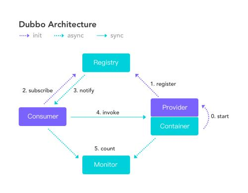

# Dubbo

#### 1、为什么要用Dubbo?

随着服务化的进一步发展，服务越来越多，服务之间的调用和以来关系越来越复杂，诞生了面向服务的架构体系（SOA）,也因此衍生出了一系列相应的技术，如对服务提供、服务调用、连接处理、通信协议、序列化方式、服务发现、服务路由、日志输出等行为进行封装的服务框架。就这样为分布式系统的服务治理框架就出现了，Dubbo也就这样产生了。

#### 2、Dubbo 的整体架构设计有哪些分层？

**接口服务层（Service）:**该层与业务逻辑相关，根据provider和consumer的业务设计对应的接口和实现

**配置层（config）:**对外配置接口，以ServiceConfig和ReferenceConfig为中心

**服务代理层（Proxy）:**服务接口透明代理，生成服务的客户端Stub和服务端的Skeleton,以ServiceProxy为中心，扩展接口为ProxyFactory

**服务注册层 （Registry）：**封装服务地址的注册和发现，以服务URL为中心，扩展接口为RegistryFactory、Registry、RegistryService

**路由层（Cluster）:**封装多个提供者的路由和负载均衡，并桥接注册中心，以Invoker为中心，扩展接口为Cluster、Directory、Router和LoadBlancce

**监控层（Monitor）：**RPC调用次数和调用时间监控，以Statistics为中心，扩展接口为MonitorFactory、Monitor和MonitorService

**远程调用层（Protocal）：**封装RPC调用，以Invocation和Result为中心，扩展接口为Protocal、Invoker和Exporter

**信息交换层（Exchange）:**封装请求响应模式，同步转异步。以Request和Response为中心，扩展接口为Exchanger、ExchangeChannel、ExchangeClient和ExchangeServer

**网络传输层（Transport）：**抽象mina和netty为统一接口，以Message为中心，扩展接口为Channel、Transporter、Client、Server和Codec

**数据序列化层（Serialize）:**可复用的一些工具，扩展接口Serialization、ObjectInput、ObjectOutput和ThreadPool

#### 3、默认使用的是什么通讯框架，还有别的选择吗?

默认也推荐使用netty框架，还有mina

#### 4、服务调用是阻塞吗？

默认是阻塞的，可以异步调用，没有返回值的可以这么做。

Dubbo是基于NIO的非阻塞实现并行调用，客户端不需要启动多线程即可完成并行调用多个远程服务，相对多线程开销小，异步调用会返回一个Future对象。

#### 5、一般使用什么注册中心？还有别的选择吗？

推荐使用zookeeper作为注册中心，还有Redis、Multicast、Simple注册中心，但不推荐。

#### 6、默认使用什么序列化框架，你知道的还有哪些？

推荐使用Hession序列化，还有Dubbo、FastJson、java自带序列化

#### 7、服务提供者能实现失效踢出是什么原理？

服务失效踢出基于zookeeper的临时节点原理

#### 8、服务上线怎么不影响旧版本？

采用多版本开发，不影响旧版本

#### 9、如何解决服务调用链过长的问题？

可以结合zipkin实现分布式服务追踪

#### 10、说说核心的配置有哪些

|       配置        |   配置说明   |
| :---------------: | :----------: |
|   dubbo:service   |   服务配置   |
|  dubbo:reference  |   引用配置   |
|  dubbo:protocol   |   协议配置   |
| dubbo:application |   应用配置   |
|   dubbo:module    |   模块配置   |
|  dubbo:registry   | 注册中心配置 |
|   dubbo:monitor   | 监控中心配置 |
|  dubbo:consumer   |  消费方配置  |
|   dubbo:method    |   方法配置   |
|  dubbo:argument   |   参数配置   |

#### 11、Dubbo推荐用什么协议？

* dubbo://(推荐)
* rmi://
* hessian://
* http://
* webservice://
* thrift://
* memcached://
* redis://
* rest://

#### 12、同一个服务多个注册的情况下可以直连某一个服务吗？

可以点对点直连，修改配置即可，也可以通过teInet直连某个服务。

#### 13、画一画服务注册与发现的流程图？

#### 14、Dubbo集群容错有几种方案？

| 集群容错方案     | 说明                                     |
| ---------------- | ---------------------------------------- |
| Failover Cluster | 失败自动切换，自动重试其他服务器（默认） |
| Failfast Cluster | 快速失败，立即报错，只发起一次调用       |
| Failsafe Cluster | 失败安全，出现异常时，直接忽略           |
| Failback Cluster | 失败自动恢复，记录失败请求，定时重发     |
| Forking Cluster  | 并行调用多个服务器，只要一个成功即返回   |
| Broadcast Cluster  | 广播逐个调用所有提供者，任意一个报错则报错   |

#### 15、Dubbo 服务降级，失败重试怎么做？

可以通过dubbo:reference中设置mock="return null".mock的值也可以修改为true,然后在跟接口同一个路径下实现一个Mock类，命名规则是”接口名称+Mock“后缀。然后在Mock类里实现自己的降级逻辑。

#### 16、Dubbo使用过程中都遇到了些什么问题？

在注册中心找不到对应的服务，检查service实现类是否添加了@Serveric注解。

无法连接到注册中心，检查配置文件中的对应的测试ip是否正确。

#### 17、Dubbo Monitor实现原理？

Consumer端在发起调用之前会先走filter链；provider端在接收到请求时也是先走filter链，然后才进行正真的业务逻辑处理。

默认情况下，在consumer和provider的filter链中都会有MonitorFilter.

1. MonitorFilter向DubboMonitor发送数据
2. DubboMonitor将数据进行聚合后（默认聚合1min中的统计数据）暂存到ConcurrentMap<Statistics,AtomicReference> statisticsMap,然后使用一个含有3个线程（线程名字：DubboMonitorSendTimer）的线程池每个1min钟，调用SimplMonitorService便利发送statisticsMap中的统计数据，每发送完毕一个，就重置当前的Statistics的AtomicReference
3. SimpleMonitorService将这些聚合数据塞入BlockingQueue queue中（队列大写为100000）
4. SimpleMonitorServie使用一个后台线程（线程名为：DubboMonitorAsyncWriteLogThread）将queue中的数据写入文件（该线程以死循环的形式来写）
5. SimpleMonitorService还会使用一个含有1个线程（线程名字：DubboMonitorTimer）的线程池每个5min钟，将文件中的统计数据画成图表

#### 18、Dubbo用到哪些设计模式？

Dubbou框架在初始化和通信过程中使用了多种设计模式，可灵活控制类加载、权限控制等功能。

**工厂模式**

provider在export服务时，会调用ServiceConfig的export方法。ServiceConfig中有个字段：

~~~~java
private static final Protocol protocol = ExtensionLoader.getExtensionLoader(Protocol.class).getAdaptiveExtension();
~~~~

Dubbo里面有很多这种代码。这也是一种工厂模式，只是实现类的获取采用了JDKSPI的机制。这么实现的有点是可扩展性强，想要扩展实现，只需要在classpath下增加个文件就可以了，代码零侵入。另外，像上面的Adaptive实现，可以做到调用时动态决定调用哪个实现，但是由于这种实现采用了动态代理，会造成代码调试比较麻烦，需要分析出实际调用的实现类。

**装饰器模式**

Dubbo在启动和调用阶段都大量使用了装饰器模式。以Provider提供的调用链为例，具体的调用链代码实在protocolFilterWrapper的buildInvokerChain完成的，具体是将注解中含有group = provider的Filter实现，按照order排序，最后的调用顺序是：

~~~~java 
EchoFilter -> ClassLoaderFilter -> GenericFilter -> ContextFilter -> ExecuteLimitFilter -> TraceFilter -> TimeoutFilter -> MonitorFilter -> ExceptionFilter
~~~~

更确切地说，这里是装饰器和责任链模式的混合使用。例如，EchoFilter的作用是判断是否是回声测试请求，是的话直接返回内容，这是一种责任链的体现。而像ClassLoaderFilter则只是在主功能上添加了功能，更改当前线程的ClassLoader，这是典型的装饰器模式。

**观察者模式**

Dubbo的Provider启动时，需要与注册中心交互，先注册自己的服务，在订阅自己的服务，订阅时，采用了观察者模式，开启一个listener。注册中心会每5秒定时检查是否有服务更新，如果有更新，向该服务的提供者发送一个notify消息，provider接受到notify消息后，即运行NotifyListener的notify方法，执行监听器方法。

**动态代理模式**

Dubbo扩展JDK SPI的类ExtensionLoader的Adaptive实现是典型的动态代理实现。Dubbo需要灵活的控制实现类，即在调用阶段动态的根据参数决定调用哪个实现类，所以采用先生成代理类的方法，能过做到灵活的调用。生成代理类的代码是ExtensionLoader的createAdaptiveExtensionClassCode方法。代理类的主要逻辑是，获取URL参数中指定参数的值作为获取实现类的key.

#### 19、Dubbo配置文件是如何加载到Spring中的？

Spring容器在启动的时候，会读取到Spring默认的一些Schema以及Dubbo自定义的Schema,每个Schema都会对应一个自己的NameSpaceHandler,NameSpaceHandler里面通BeanDfinitionParser来解析配置信息并转换为需要加载的bena对象！

#### 20、Dubbo SPI 和Java SPI 区别？

**JDK SPI**

JDK 标准的SPI会一次性加载所有的扩展实现，如果有的扩展实现很耗时，但也没用上，很浪费资源。所有只希望加载某个的实现，就不现实了

**Dubbo SPI**

1. 对Dubbo进行扩展，不需要改动Dubbo的源码
2. 延迟加载，可以一次只加载自己想要加载的扩展实现
3. 增加了对扩展点IOC和AOP的支持，一个扩展点可以直接setter注入其他扩展点
4. Dubbo的扩展机制能很好的支持第三方IOC容器，默认支持SpringBean

#### 21、Dubbo支持分布式事务吗？

目前暂时不支持，可与通过tcc-transaction框架实现

介绍：tcc-transaction是开源的TCC补偿性分布式事务框架

Git地址：https://github.com/changmingxie/tcc-transaction

TCC-Tracnsation 通过Dubbo隐式传参的功能，避免自己对业务代码的入侵。

#### 22、Dubbo可以对结果进行缓存吗？

为了提高数据访问的速度。Dubbo提供了声明式缓存，以减少用户加缓存的工作量

~~~~java
<dubbo:refrerence cache="true"/>
~~~~

其实比普通的配置文件就多一个标签 cache="true"

#### 23、服务上线怎么兼容旧版本？

可以用版本号（version）过度，多个不同版本的服务注册到注册中心，版本号不用的服务相互间不引用。这个和服务分组的概念有一点类似。

#### 24、Dubbo必须依赖的包有哪些？

Dubbo必须依赖JDK,其他为可选

#### 25、Dubbp telnet命令能做什么？

dubbo服务发布之后，我们可以利用telnet命令进行调试、管理。

Dubbo2.0.5以上版本服务提供接口支持telnet命令

**连接服务**

~~~~shell
telnet localhost 20880 //键入回车进入Dubbo命令模式
~~~~

**查看服务列表**

~~~~shell
dubbo>ls
com.test.TestService
dubbo>ls com.test.TestService
create
delete
query
~~~~

* ls（list services and methods）
* ls:显示服务列表
* ls XxxService:显示服务的方法列表
* ls -l XxxService:显示服务的方法详细信息列表

#### 26、Dubbo支持服务降级吗？

以通过dubbo:reference中设置 mock="return null"。mock的值也可以修改为true,然后在跟接口同一个路径下实现一个Mock类，命名规则是”接口名称+Mock"后缀，然后Mock类里实现自己的降级逻辑。

#### 27、Dubbo如何优雅停机？

Dubbo是通过JDK的ShutDownHook来完成优雅停机的，所以如果使用kill -9 PID等强制关闭指令，是不会执行优雅停机的，只有通过kill PID时，才会执行。

#### 28、Dubbo和Dubbox之间的区别？

Dubbox时继Dubbo停止维护后，当当网基于Dubbo做的一个扩展项目，如果加了服务可Restful调用，更新了开源组件等。

### 29、Dubbo和SpringCloud的区别？

根据微服务结构在各方面的要素，看看Spring Cloud和Dubbo都提供了哪些支持。

|              | Dubbo     | Spring Cloud                 |
| ------------ | --------- | ---------------------------- |
| 服务注册中心 | Zookeeper | Spring Cloud Netflix Eureka  |
| 服务调用方式 | RPC       | REST API                     |
| 服务网关     | 无        | Spring Cloud Netflix Zuul    |
| 断路器       | 不完善    | Spring Cloud Netflix Hystrix |
| 分布式配置   | 无        | Spring Cloud Config          |
| 服务跟踪     | 无        | Spring Cloud Sleuth          |
| 消息总线     | 无        | Spring Cloud Bus             |
| 数据流       | 无        | Spring Cloud Steam           |
| 批量任务     | 无        | Spring Cloud Task            |
| ......       | ......    | ......                       |

使用Dubbo构建的微服务架构就像组装电脑，各个环节我们的选择自由度很好，但是最终结果很有可能因为一条内存质量不行就点不亮了，总是让人不怎么放心，但是如果你是一名高手，那这些都不是问题；而Spring Cloud就像品牌机，在Spring Source的整合下，做了大量的兼容性测试，保证了机器拥有更高的稳定性，但是如果要在使用非原装组件外的东西，就需要对其基础有足够的了解。

#### 30、你还了解别的分布式框架吗？

别的还有spring的spring Cloud,facebook的thrift,twitter的finagle等